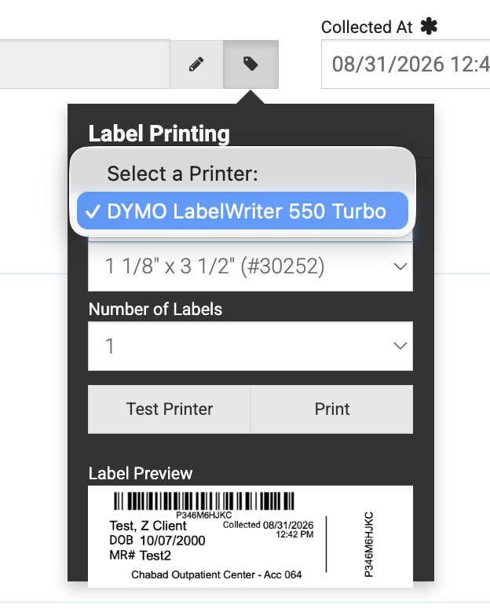

# DymoBridge — Office Mac Setup (one page)

Sets up a front-desk Mac so Kipu in Chrome prints specimen labels to a DYMO
LabelWriter 550. Takes about 10 minutes. No Terminal needed.

## What you need

- Apple Silicon Mac (M1 or newer), macOS 13 or later, and an **admin login**
- DYMO LabelWriter 550 / 550 Turbo, its power + USB cables, genuine DYMO labels
- Two installers: **DYMO Connect for Desktop** (Mac version, from DYMO) and
  the **DymoBridge installer pkg** (from Sandy)

## Part 1 — DYMO driver (~5 min)

1. Download and run the DYMO Connect for Desktop installer for Mac. Get it
   from DYMO's support site (Software & Drivers → DYMO Connect for Desktop):
   https://www.dymo.com/support
2. If macOS offers to install **Rosetta**, allow it. (Only DYMO's own app
   needs it — DymoBridge does not.)
3. Plug the LabelWriter into power and USB, turn it on, and load labels.
4. Open **System Settings → Printers & Scanners** and confirm
   **DYMO LabelWriter 550** appears in the list. If it doesn't, click
   **Add Printer** and select it.

## Part 2 — DymoBridge (~2 min)

5. Double-click the **DymoBridge pkg** and click through the installer.
   Enter the admin password when asked. (The installer is signed and
   notarized, so macOS opens it without complaint.)
6. That's it. The installer starts DymoBridge in the background, sets up its
   security certificate, and turns off DYMO's own web service (reversibly).
   Nothing to open or configure.

## Part 3 — Verify (~1 min)

7. In Chrome, open the DymoBridge health page — it should load without a
   security warning and list the LabelWriter as connected:
   https://127.0.0.1:41951/
8. Log into Kipu and print a specimen label as usual. It should print
   exactly like the old vendor-printed tags.
   - **First print only:** in Kipu's Label Printing popup, click
     **Select a Printer** and choose **DYMO LabelWriter 550 Turbo**
     (see below). Kipu remembers the choice after that.

   

## If something's off

- **Health page won't load** — log out and back in (the service starts at
  login), or restart the Mac.
- **Health page loads but no printer listed** — check USB and power, and that
  the printer shows in Printers & Scanners (Part 1, step 4).
- **Printer's light flashes / labels come out blank** — the 550 requires
  genuine DYMO-brand labels; check the roll is DYMO and loaded correctly.
- **Security warning comes back after ~2 years** — the certificate expired;
  run the DymoBridge pkg again (it renews silently).
- **Remove DymoBridge** (restores DYMO's web service): have an admin run
  `/usr/local/share/dymo-bridge/uninstall.sh` in Terminal with `sudo`.

*Order matters: always install DYMO Connect (Part 1) before DymoBridge
(Part 2). If DYMO Connect is ever reinstalled or updated later, run the
DymoBridge pkg again afterward.*
